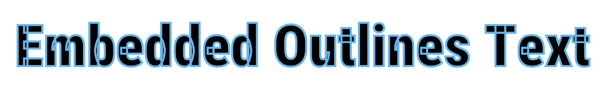

# rough-py Frequently Asked Questions

## How to convert existing Rough.js examples?

The Rough.js [API syntax](https://github.com/rough-stuff/rough/wiki) is very similar to `rough-py` and only needs minor translation.

For example, this JavaScript code:
```javascript
canvas.line(60, 60, 190, 60, {strokeWidth: 5});
canvas.polygon([[690, 130], [790, 140], [750, 240], [690, 220]]);
```

...becomes this python code:

```python
canvas.line(60, 60, 190, 60, Options(strokeWidth=5))
canvas.polygon([[690, 130], [790, 140], [750, 240], [690, 220]])
```


## When I stroke a font text outline, why are there overlapping polygons?


Reliably clipping and filling overlapping polygons is a difficult problem. There are third-party libraries and tools which give reliable results, but would drag in external dependencies that are best left for other tools.


## Good ways to convert an SVG image to a PNG, JPG, WEBP, etc?

A recommended and very reliable solution is `rsvg-convert`, part of `librsvg` at https://gitlab.gnome.org/GNOME/librsvg/. Other solutions include [Inkscape](https://inkscape.org/) in both graphical UI and command-line modes. It's also possible to use Imagemagick's `convert` utility, and there are many other popular tools -- just beware of less reliable reproduction of edge-case behaviors (gradient colors, for example) if those details are important to your use case.


## Why is my SVG so large??

Alas, your new rough lifestyle comes at a cost. Instead of being able to represent a line with just two points, sketchy-style lines must have *many, many* points so that each point can be jostled around a bit to give the trademark hand-drawn look. These additional points each take up space and can easily lead to large SVG files (many megabytes or more if not careful). In many cases, the best choice is to convert your rough SVG images into a raster format like a PNG (see related FAQ item for instructions).


## Why does the syntax have some snake_case and some camelCase?

A goal was to match the original Rough.js JavaScript API as much as possible, so those things try to use camelCase, otherwise snake_case is used to adhere to python conventions.
