# rough-py API Examples Gallery

## Start with...
```python
from rough import canvas, Options

c = canvas(600, 150)
```


## Lines, Rectangles, Circle
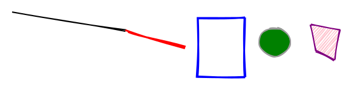
```python
c.line(10, 10, 200, 40)

c.line(200, 40, 300, 70, Options(stroke="red", strokeWidth=3.0, roughness=2))

c.rectangle(320, 20, 80, 100, Options(stroke="blue", strokeWidth=3.0))

c.circle(450, 60, 50, Options(fill="green", fillStyle="solid", stroke="#999"))

points = [(510, 30), (560, 40), (550, 90), (520, 75)]
c.polygon(points, Options(stroke="purple", fill="#ffc0cb", fillStyle="hachure"))
```
[view code](example1.py)


## Arcs and Paths

```python
# arc (open)
c.arc(50, 100, 80, 80, 0, 3.14, False, Options(stroke="blue", roughness=1))

# closed arc with solid fill
c.arc(150, 100, 60, 60, 1.57, 4.71, True, Options(fill="orange", fillStyle="solid"))

# freeform path to create a small wave
path_str = "M 220 80 C 240 20, 300 20, 320 80 S 380 140, 400 80"
c.path(path_str, Options(stroke="purple", strokeWidth=2.5))

# second path with fill
path_str2 = "M 450 50 L 500 50 L 500 90 L 450 90 Z"
c.path(path_str2, Options(fill="yellow", fillStyle="hachure", strokeWidth=1.5))

# circle with dashed stroke
c.circle(550, 80, 40, Options(stroke="red", strokeLineDash=[4,2]))
```
[view code](example2.py)


## Various Fills
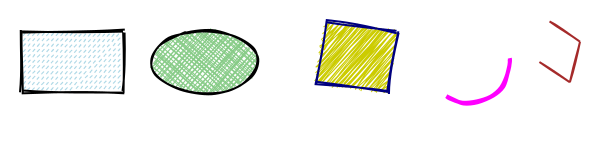
```python
# dashed rectangle
c.rectangle(20, 30, 100, 60, Options(stroke="black", fill="lightblue", fillStyle="dashed"))

# filled ellipse in cross-hatch
c.ellipse(200, 60, 100, 60, Options(fill="#88cc88", fillStyle="cross-hatch"))

# polygon with zigzag fill
pts = [(320, 20), (390, 30), (380, 90), (310, 80)]
c.polygon(pts, Options(stroke="navy", fill="#cccc00", fillStyle="zigzag"))

# arc with no fill, thick stroke
c.arc(460, 60, 80, 80, 0, 2.14, False, Options(stroke="magenta", strokeWidth=4))

# line path with preserve vertices
line_points = [(540, 20), (570, 40), (560, 80), (530, 60)]
c.linearPath(line_points, Options(stroke="brown", preserveVertices=True))
```
[view code](example3.py)


## Arcs and Ellipses
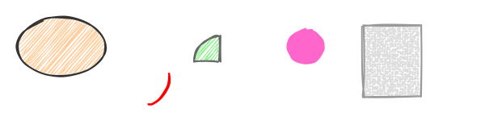
```python
# big ellipse, hatch fill
c.ellipse(80, 60, 120, 80, Options(fill="#ffcc99", fillStyle="hachure", stroke="#333"))

# partial arc
c.arc(200, 100, 60, 80, 0, 1.57, False, Options(stroke="red", strokeWidth=2.5))

# arc with fill, closed
c.arc(300, 80, 70, 70, 3.14, 4.71, True, Options(fill="lightgreen", stroke="#666"))

# circle with no stroke, just fill
c.circle(420, 60, 50, Options(stroke="none", fill="#ff66cc", fillStyle="solid"))

# rectangle with dotted fill
c.rectangle(500, 30, 80, 100, Options(fill="#ddd", fillStyle="dots", stroke="#999"))
```
[view code](example4.py)


## Polygons and Lines
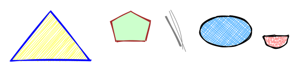
```python
# triangle
tri_pts = [(20, 120), (100, 20), (180, 120)]
c.polygon(tri_pts, Options(stroke="blue", fill="#ffff66", fillStyle="hachure"))

# pentagon
pent_pts = [(220, 40), (260, 20), (300, 40), (290, 80), (230, 80)]
c.polygon(pent_pts, Options(stroke="brown", fill="#ccffcc", fillStyle="solid"))

# random lines
c.line(330, 30, 360, 90, Options(strokeWidth=3, stroke="gray"))
c.line(340, 20, 370, 100, Options(strokeWidth=1, stroke="gray", roughness=3))

# ellipse with cross-hatch
c.ellipse(450, 60, 100, 60, Options(fill="#66bbff", fillStyle="cross-hatch"))

# closed arc in dotted fill
c.arc(550, 70, 50, 50, 0, 3.14, True, Options(fill="#ff9999", fillStyle="dots"))
```
[view code](example5.py)


## Custom Dashes
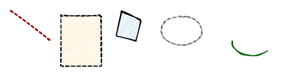
```python
# line with dash pattern
c.line(20, 20, 100, 80, Options(stroke="darkred", strokeWidth=3, strokeLineDash=[6, 4]))

# rectangle with dash offset
c.rectangle(120, 30, 80, 100, Options(strokeLineDash=[8,3], strokeLineDashOffset=4, fill="#ffeecc"))

# polygon with fill dash
poly_pts = [(240, 20), (280, 40), (270, 80), (230, 70)]
c.polygon(poly_pts, Options(fill="lightblue", fillStyle="hachure", fillLineDash=[3,2]))

# ellipse with custom stroke dash
c.ellipse(360, 60, 80, 60, Options(strokeLineDash=[1,2,6,2], stroke="#666"))

# arc with no fill
c.arc(500, 80, 80, 60, 0.7, 3.14, False, Options(stroke="darkgreen", strokeWidth=2))
```
[view code](example6.py)


## Overlapping Rects
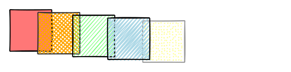
```python
# set some defaults
my_defaults = Config(Options(fillWeight=2.0, hachureGap=20.0))
c: RoughCanvas = canvas(600, 150, my_defaults)

# solid fill
c.rectangle(20, 20, 300, 300, Options(fill="#ff7777", fillStyle="solid", strokeWidth=2))

# cross-hatch fill
c.rectangle(
    220, 40, 300, 300, Options(fill="orange", fillStyle="cross-hatch", stroke="#333")
)

# hachure fill
c.rectangle(
    470, 60, 300, 300, Options(fill="#77ff77", fillStyle="hachure", fillWeight=1.0)
)

# dots fill (gold-color rect at the end)
c.rectangle(
    970, 100, 300, 300, Options(fill="#ffff99", fillStyle="dots", stroke="#999")
)

# zigzag fill (second to last, grey fill)
c.rectangle(720, 80, 300, 300, Options(fill="lightblue", fillStyle="zigzag"))
```
[view code](example7.py)


## Roughness on Arcs
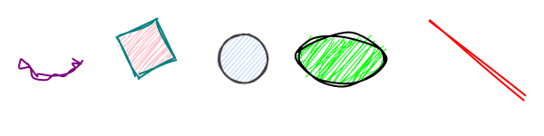
```python
# very rough arc
c.arc(60, 60, 60, 40, 0, 3.14, False, Options(stroke="purple", roughness=4))

# polygon with moderate roughness
pts = [(130, 40), (170, 20), (190, 60), (150, 80)]
c.polygon(pts, Options(stroke="teal", fill="pink", roughness=2))

# circle with minimal roughness
c.circle(260, 60, 50, Options(fill="#ccddff", stroke="#444", roughness=0.5))

# ellipse with high roughness
c.ellipse(360, 60, 90, 50, Options(fill="lime", roughness=3))

# line with moderate roughness
c.line(450, 20, 550, 100, Options(stroke="red", roughness=2))
```
[view code](example8.py)


## Paths and Arcs
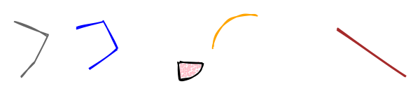
```python
# linear path
points = [(10, 20), (60, 40), (40, 80), (20, 100)]
c.linearPath(points, Options(stroke="#666", strokeWidth=2))

# second linear path with fill
points2 = [(100, 30), (140, 20), (160, 60), (120, 90)]
c.linearPath(points2, Options(stroke="blue", fill="#cff", fillStyle="dashed"))

# closed arc with dotted fill
c.arc(250, 80, 70, 50, 0, 1.57, True, Options(fill="pink", fillStyle="dots"))

# open arc
c.arc(350, 60, 100, 100, 3.14, 5.0, False, Options(stroke="orange"))

# random line
c.line(480, 30, 580, 100, Options(stroke="brown", strokeWidth=3))
```
[view code](example9.py)


## Multiple Polygons
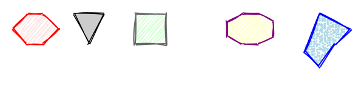
```python
hex_pts = [(20,40),(40,20),(60,20),(80,40),(60,60),(40,60)]
c.polygon(hex_pts, Options(fill="#ffe0e0", stroke="red", fillStyle="hachure"))

tri_pts = [(100, 20), (140, 20), (120,60)]
c.polygon(tri_pts, Options(fill="#ccc", strokeWidth=1.5, fillStyle="solid"))

square_pts = [(180, 20), (220, 20), (220,60), (180,60)]
c.polygon(square_pts, Options(fill="#ccffcc", stroke="#666"))

oct_pts = [(300,30),(320,20),(340,20),(360,30),(360,50),(340,60),(320,60),(300,50)]
c.polygon(oct_pts, Options(fill="#ffffcc", stroke="purple", fillStyle="cross-hatch"))

# random polygon
rand_pts = [(420,20),(460,40),(440,60),(420,90),(400,70)]
c.polygon(rand_pts, Options(fill="lightblue", stroke="blue", fillStyle="dots"))
```
[view code](example10.py)


## Assorted Arc Fills
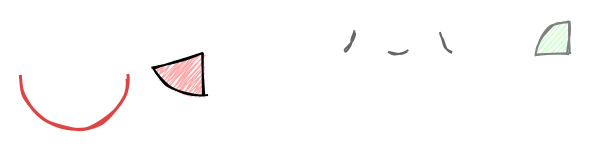
```python
# large arc half circle
c.arc(60, 100, 100, 100, 0, 3.14, False, Options(stroke="#dd4444", strokeWidth=3))

# closed arc
c.arc(180, 80, 100, 80, 1.57, 2.8, True, Options(fill="#ffaaaa", fillStyle="zigzag"))

# small arcs repeated
c.arc(300, 60, 40, 40, 0, 1.0, False, Options(stroke="#666"))
c.arc(360, 60, 40, 40, 1.0, 2.0, False, Options(stroke="#666"))
c.arc(420, 60, 40, 40, 2.0, 3.14, False, Options(stroke="#666"))

# final arc closed with fill
c.arc(520, 80, 60, 60, 3.14, 4.71, True, Options(fill="#ccffcc", stroke="gray"))
```
[view code](example11.py)


## Stroke Variety
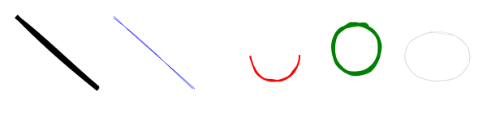
```python
# thick line
c.line(20, 30, 120, 120, Options(stroke="black", strokeWidth=5))

# thin line
c.line(140, 30, 240, 120, Options(stroke="blue", strokeWidth=0.5))

# arc with moderate stroke
c.arc(340, 80, 60, 60, 0, 3.14, False, Options(stroke="red", strokeWidth=2))

# circle with wide stroke
c.circle(440, 70, 60, Options(stroke="green", strokeWidth=4))

# ellipse with extremely thin stroke
c.ellipse(540, 80, 80, 60, Options(stroke="#999", strokeWidth=0.2))
```
[view code](example12.py)


## Fill Shape Roughness
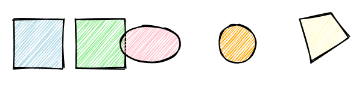
```python
# rectangle with normal fill shape roughness gain
c.rectangle(20, 30, 80, 80, Options(fill="lightblue", fillStyle="hachure"))

# rectangle with higher fill shape roughness gain
c.rectangle(120, 30, 80, 80, Options(fill="lightgreen", fillStyle="hachure", fillShapeRoughnessGain=2.5))

# ellipse with fill shape roughness
c.ellipse(240, 70, 100, 60, Options(fill="pink", fillShapeRoughnessGain=1.5))

# circle with fill shape roughness
c.circle(380, 70, 60, Options(fill="orange", fillShapeRoughnessGain=3.0))

# polygon with lower fill shape roughness
pts = [(480, 30), (530, 20), (560, 60), (500, 100)]
c.polygon(pts, Options(fill="#fffccc", fillShapeRoughnessGain=0.3))
```
[view code](example13.py)


## Preserve Vertices
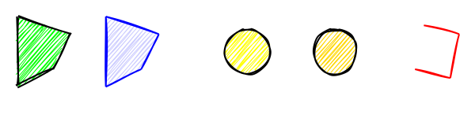
```python
# polygon with normal corners
pts1 = [(20,20), (80,40), (60,80), (20,100)]
c.polygon(pts1, Options(fill="lime"))

# polygon with preserve vertices
pts2 = [(120,20), (180,40), (160,80), (120,100)]
c.polygon(pts2, Options(fill="#ccf", stroke="blue", preserveVertices=True))

# circle normal
c.circle(280, 60, 50, Options(fill="yellow"))

# circle preserve vertices
c.circle(380, 60, 50, Options(fill="gold", preserveVertices=True))

# line path preserve vertices
line_pts = [(480, 30), (520, 40), (510, 90), (470, 80)]
c.linearPath(line_pts, Options(stroke="red", preserveVertices=True))
```
[view code](example14.py)


## Swirls and Arcs
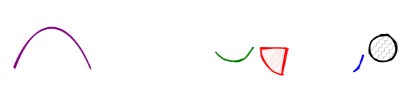
```python
# swirl-like path
swirl = "M 20 100 C 50 20, 100 20, 130 100 S 180 180, 210 100 S 260 20, 290 100"
c.path(swirl, Options(stroke="purple", strokeWidth=2))

# arcs with random angles
c.arc(340, 60, 60, 60, 0.2, 2.6, False, Options(stroke="green"))
c.arc(420, 70, 80, 80, 1.8, 3.14, True, Options(fill="#ffdddd", stroke="red"))
c.arc(500, 80, 60, 60, 0, 1.0, False, Options(stroke="blue"))

# circle with zigzag-line fill
c.circle(560, 70, 40, Options(fillStyle="zigzag-line", fill="#ccc"))
```
[view code](example15.py)


## Seeding Draws
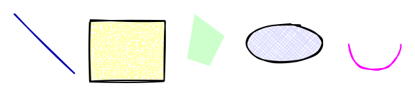
```python
# specify seed for consistent random style
seeded_opts = Options(stroke="#00a", roughness=1, seed=1234)
c.line(20, 20, 100, 100, seeded_opts)

# rectangle with a different seed
c.rectangle(120, 30, 100, 80, Options(fill="#ffa", fillStyle="dots", seed=5678))

# polygon with no stroke, only fill
pts = [(260,20),(300,50),(280,90),(250,80)]
c.polygon(pts, Options(stroke="none", fill="#ccffcc", fillStyle="solid"))

# ellipse with cross-hatch
c.ellipse(380, 60, 100, 50, Options(fill="#ddf", fillStyle="cross-hatch"))

# arcs with different seeds
c.arc(500, 60, 70, 70, 0, 3.14, False, Options(stroke="magenta", seed=999))
```
[view code](example16.py)


## Canvas Rotate, Translate, and Scale
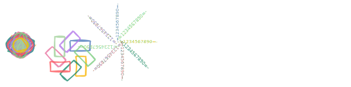
```python
# draw a series of overlapping rectangles
for angle in range(0, 360, 45):
    # rotate the canvas before drawing the next shape
    angle_radians = angle * 3.14159 / 180
    c.ctx.rotate(angle_radians)

    # choose a stylish fill color
    stroke_color = palette[angle // 45 % len(palette)]

    c.rectangle(
        50, 0, 90, 180,
        Options(stroke=stroke_color, fillStyle="hachure", roughness=3.0, bowing=2.0),
    )

# translate the drawing origin
c.ctx.translate(450, 100)

# draw a series of overlapping circles
for x in range(8):
    # scale down the canvas
    c.ctx.scale(0.9, 0.9)

    # fancify
    fill_color = palette[x % len(palette)]
    stroke_color = palette[(x + 1) % len(palette)]

    c.circle(
        0, 0, 300,
        Options(
            roughness=6.0,
            fill=fill_color,
            stroke=stroke_color,
            hachureGap=35,
            fillStyle="zigzag",
        ),
    )

# reset scale and translate the drawing origin
c.ctx.resetTransform()
c.ctx.translate(440, -100)

# draw a series of rotated text elements
for angle in range(0, 360, 45):
    angle_radians = angle * 3.14159 / 180
    c.ctx.rotate(angle_radians)

    c.ctx.translate(-10, -20)

    fill_color = palette[angle // 45 % len(palette)]

    c.text(
        0, 0, "-=1234567890=-",
        Options(fill=fill_color, fillStyle="hachure", fontFamily="Impact", fontSize=40),
        embed_outline=True,
    )
```
[view code](example17.py)


## Canvas Size Auto-Fit
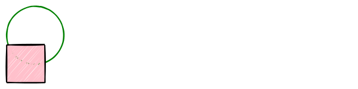
```python
# draw shapes that go beyond normal 600x200 range
c.ellipse(50, 50, 300, 300, Options(stroke="green"))
c.rectangle(-100, 100, 200, 200, Options(fill="pink"))

# render the canvas as SVG (Scalable Vector Graphics) code
# notice the autofit parameters
svg_data = c.as_svg(600, 150, auto_fit=True, auto_fit_margin=10)
```
[view code](example18.py)


## Single-stroke and Very Small Shapes
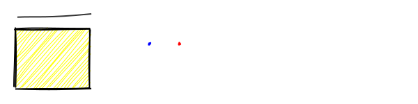
```python
# line with multi-stroke disabled
c.line(20, 20, 120, 20, Options(disableMultiStroke=True, stroke="#333", roughness=3))

# rectangle with no multi-stroke on fill
c.rectangle(20, 40, 100, 80, Options(disableMultiStrokeFill=True, fill="yellow"))

# intentionally zero-size circle
c.circle(200, 60, 0, Options(stroke="blue", fill="#eee"))

# very small ellipse
c.ellipse(240, 60, 1, 1, Options(stroke="red", fill="#fcc"))
```
[view code](example19.py)


## Overlapping Paths
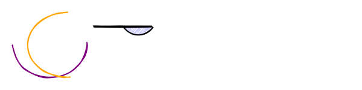
```python
# big arc
c.arc(100, 100, 200, 180, 0, 3.14, False, Options(stroke="purple", strokeWidth=2))

# second overlapping arc
c.arc(150, 100, 220, 180, 1.57, 4.71, False, Options(stroke="orange"))

# another path
d_str = "M 220 50 L 300 50 C 320 80, 360 80, 380 50 Z"
c.path(d_str, Options(fill="#ccf"))
```
[view code](example20.py)


## Custom Dashed Lines
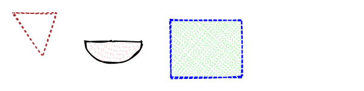
```python
# polygon with custom stroke dash
poly_pts = [(20, 20), (80, 20), (60, 80)]
c.polygon(poly_pts, Options(strokeLineDash=[4, 4], strokeLineDashOffset=2, stroke="brown"))

# arc with fill line dash
c.arc(160, 60, 80, 60, 0, 3.14, True, Options(fill="pink", fillStyle="hachure", fillLineDash=[2, 6]) )

# rectangle with different dash for stroke vs fill
c.rectangle(240, 30, 100, 80, Options( stroke="blue", strokeLineDash=[6, 2], fill="lightgreen", fillStyle="cross-hatch", fillLineDash=[1, 4]))
```
[view code](example21.py)


## Custom Shapes (Star)
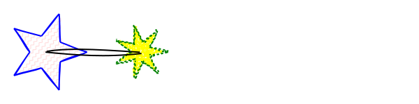
```python
def star_points(
    cx: float, cy: float, spikes: int, outer_r: float, inner_r: float
):
    pts = []
    step = math.pi / spikes
    angle = 0.0
    for i in range(spikes * 2):
        r = outer_r if i % 2 == 0 else inner_r
        sx = cx + r * math.cos(angle)
        sy = cy + r * math.sin(angle)
        pts.append((sx, sy))
        angle += step
    return pts

# star shape with preserveVertices
pts = star_points(80, 80, spikes=5, outer_r=60, inner_r=25)
c.polygon(pts, Options(stroke="blue", fill="#fdd", fillStyle="zigzag-line", preserveVertices=True))

# smaller star with dashed stroke
pts2 = star_points(220, 80, spikes=7, outer_r=40, inner_r=15)
c.polygon(
    pts2,
    Options(
        stroke="green",
        strokeLineDash=[3, 3],
        fill="yellow",
        fillStyle="dots",
        roughness=1.5,
    ),
)

# line connecting the stars, using multi-stroke
c.line(80, 80, 220, 80, Options(stroke="black", roughness=2))
```
[view code](example22.py)


## Auto-Fit
auto_fit=False: 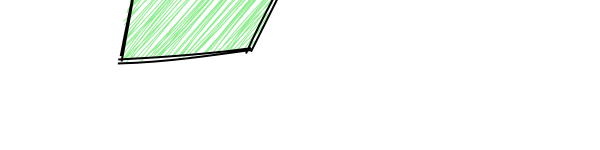
auto_fit=True: 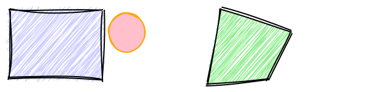
```python
# shapes placed at negative coordinates to push bounding beyond normal view
c.rectangle(-300, -100, 200, 150, Options(fill="#ccf", roughness=3, seed=42))
c.circle(
    -50, -50, 80, Options(stroke="orange", fill="pink", fillStyle="solid", seed=999)
)

# large polygon straddling origin
pts = [(150, -100), (300, -50), (250, 50), (120, 60)]
c.polygon(pts, Options(fill="lightgreen", fillStyle="hachure", roughness=2, seed=123))

# render the canvas as SVG (Scalable Vector Graphics) code
svg_data: str = c.as_svg(600, 150, auto_fit=False)

...

# create another version with auto_fit to compare the difference.
# auto_fit ensures entire scene fits in final 600x200
# note that auto_fit is True by default, so you don't have to specify
# unless you want to disable it
svg_data: str = c.as_svg(600, 150, auto_fit=True, auto_fit_margin=10)
```
[view code](example23.py)


## Rotate before drawing vs Rotate after
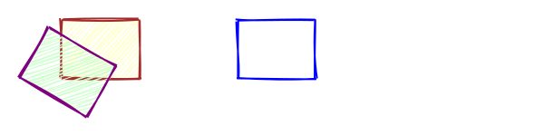
```python
# draw a rectangle normally
c.rectangle(20, 20, 80, 60, Options(fill="#ffc", stroke="brown"))

# rotate the context, then draw a similar rectangle
c.ctx.rotate(math.pi / 6.0)  # rotate 30 degrees
c.rectangle(20, 20, 80, 60, Options(fill="#cfc", stroke="purple"))

# reset transform and rotate the rectangle data "manually" by using path string
c.ctx.resetTransform()
path_rect = "M 200 20 L 280 20 L 280 80 L 200 80 Z"  # unrotated

# rotate around center ~ (240,50)
rotation_angle = 45.0
c.path(path_rect, Options(stroke="blue", roughness=1))
```
[view code](example24.py)


## Shape Size Extremes and Selective Multi-stroking
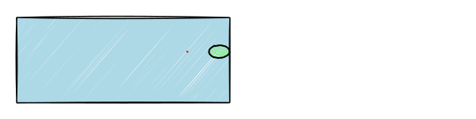
```python
# extremely large rectangle, partially off-canvas
# note: auto_fit defaults to True, so it will scale unless auto_fit=False below
c.rectangle(
    -500, -100, 1000, 400, Options(fill="lightblue", stroke="black", strokeWidth=1.5)
)

# a very small circle with multi-stroke disabled to preserve a crisp shape
c.circle(300, 60, 0.5, Options(stroke="red", disableMultiStroke=True, roughness=2))

# an ellipse that uses fillLineDash separately from stroke dash
c.ellipse(450, 60, 100, 60, Options( strokeLineDash=[6, 3], fillLineDash=[2, 2], fill="lightgreen", fillStyle="hachure" ) )
```
[view code](example25.py)


## rough-py Logo using Embedded Text Outlines
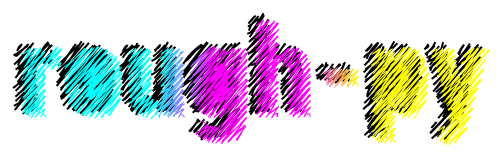
```python
# using a list of colors for "fill" makes an SVG gradient
# colors have duplicate entries to force sharper transitions
palette = [
    "#00FFFF",
    "#00FFFF",
    "#00FFFF",
    "#00FFFF",
    "#FF00FF",
    "#FF00FF",
    "#FF00FF",
    "#FFFF00",
    "#FFFF00",
]

# white text "ROUGH"
# using embed_outlines to store text as polygon path
opts = Options()
opts.fontFamily = "Impact"
opts.fontSize = 150
opts.fontPath = "resources/fonts/Roboto/static/Roboto_Condensed-Black.ttf"
opts.fill = "white"
opts.fillStyle = "hachure"
opts.strokeWidth = 0
opts.hachureGap = 5.0
opts.roughness = 2.0
c.text(45, 95, "rough-py", options=opts, embed_outline=True)

# black text "ROUGH"
opts = Options()
opts.fontFamily = "Impact"
opts.fontSize = 150
opts.fontPath = "resources/fonts/Roboto/static/Roboto_Condensed-Black.ttf"
opts.fill = "black"
opts.fillStyle = "hachure"
opts.fillWeight = 2.0
opts.strokeWidth = 0
opts.hachureGap = 5.0
opts.roughness = 2.0
c.text(50, 100, "rough-py", options=opts, embed_outline=True)

# CMYK gradient text "ROUGH"
opts = Options()
opts.fontSize = 150
opts.fontPath = "resources/fonts/Roboto/static/Roboto_Condensed-Black.ttf"
opts.fill = palette
opts.fillWeight = 1.0
opts.fillStyle = "zigzag"
opts.gradientAngle = 35.0
opts.hachureGap = 5.0
opts.strokeWidth = 0
opts.roughness = 1.0
c.text(60, 105, "rough-py", options=opts, embed_outline=True)
```
[view code](example26.py)


## Sketchy Text

```python
palette = ["#E63946", "#F4A261", "#2A9D8F", "#264653"]

# referenced text (font not embedded into SVG)
opts = Options()
opts.fontFamily = "Cooper Black, Impact, Verdana, Helvetica"
opts.fontSize = 32
opts.fill = palette[0]
c.text(50, 0, "Text using browser/OS fonts", options=opts)

opts.fontFamily = "Cooper Black, Impact, Verdana, Helvetica"
opts.fontSize = 32
opts.fill = palette[2]
c.text(50, 50, "...not roughenable, but legible and efficient", options=opts)

# text converted to outlines and stored in the SVG
opts = Options()
opts.fontSize = 50
# note the required use of 'fontPath' when embed_outline=True
opts.fontPath = "resources/fonts/Roboto/static/Roboto_Condensed-Black.ttf"
opts.fill = palette[0:4]
opts.fillStyle = "hachure"
opts.hachureGap = 2.0
opts.roughness = 1.0
opts.bowing = 1.0
opts.strokeWidth = 0
c.text(50, 120, "Text as polygons... ROUGHable, but big files!", options=opts, embed_outline=True)
```
[view code](example27.py)


## Consistently Identical Shapes
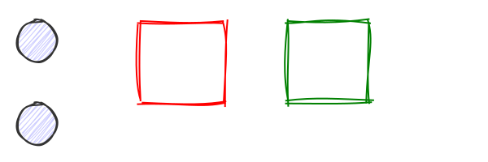
```python
# same seed for two circles => identical roughness
c.circle(100, 50, 40, Options(stroke="#333", fill="#ccf", seed=42))
c.circle(100, 130, 40, Options(stroke="#333", fill="#ccf", seed=42))

# no seed => different roughness every time
c.rectangle(200, 30, 80, 80, Options(stroke="red", roughness=2.0))

# a different seed => stable but distinct roughness
c.rectangle(340, 30, 80, 80, Options(stroke="green", roughness=2.0, seed=99))
```
[view code](example29.py)


## Gradients as Fill and Stroke
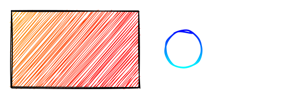
```python
# supply multiple colors in a list for fill
rect_with_gradient = c.rectangle(
    10, 10, 200, 120,
    Options(
        fill=["#FFA500", "#FF0000"],  # from orange to red
        gradientAngle=45.0,           # angle in degrees
        gradientSmoothness=2          # how many intermediate stops to generate
    )
)

# similarly for stroke, you can do:
circle_with_gradient_stroke = c.circle(
    280, 70, 60,
    Options(
        stroke=["#00F", "#0FF"],      # from blue to cyan
        strokeWidth=3,
        gradientAngle=90.0,
        gradientSmoothness=3
    )
)
```
[view code](example30.py)

